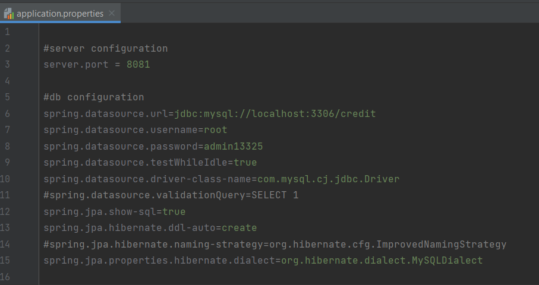

<h1 align="center">Welcome to Credit Operations 👋</h1>
<p>
  <a href="ad" target="_blank">
    
  </a>
</p>

> It is like a Credit Interface. A user can create account, get account details, create, update and get limit offers

### ✨ [Demo](asd)

# Project Setup


API Collection Link ->  https://api.postman.com/collections/28775522-9c15322f-3914-4c32-bb40-837a71751921?access_key=PMAT-01H74YXGERZAC74EX5MKZCFKBZ

## TechStack
```text
1. Java 17
2. SpringBoot 3.1.2
3. MySQL 8
4. Maven
```


## Deployment Steps

### Setup Files

Application Properties File




### Running locally
1. Install Java 17 and Mysql 8 and clone the repo. Create the database ***credit*** manually
2. Set these mysql properties in the application properties file ->
```text
server.port=8081
-------------------------------------------------------------------------
spring.datasource.url=jdbc:mysql://localhost:3306/credit
spring.datasource.username=<username>
spring.datasource.password=<password>
```
3. Now go to ***CreditCardApplication*** Class and run it to start the application.


You can access the apis via postman on 8081 port.


## Author

👤 **Saumitra Chauhan**

* Website: https://read.cv/saumitra
* Github: [@SHADOW13325](https://github.com/SHADOW13325)
* LinkedIn: [@saumitrachauhan](https://linkedin.com/in/saumitrachauhan)
